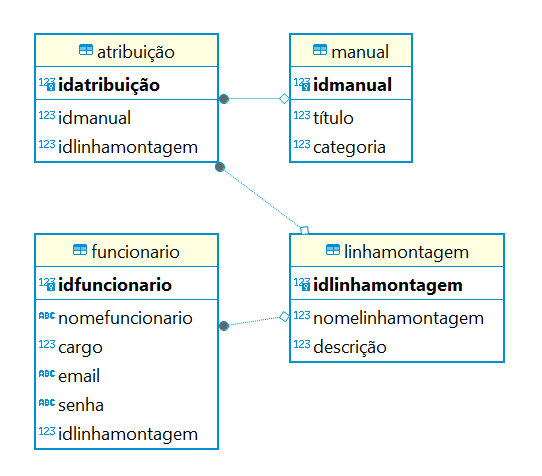

# Edellcation - Modelagem do banco de dados

## Descrição
Este projeto, feito para a empresa Dell, visa expor os manuais de instruções de montagens de aparelhos em um único lugar para que o acesso por parte dos funcionários seja mais eficiente. Além disso, os administradores podem adicionar, deletar e designar manuais para funcionários e linhas de produção, proporcionando uma gestão eficaz e centralizada dos recursos de montagem.

O banco de dados foi modelado utilizando a ferramenta [WWW SQL Designer](https://github.com/ondras/wwwsqldesigner/), que proporciona uma interface visual para criar e visualizar modelos de banco de dados relacionais. Com recursos gráficos como tabelas, chaves primárias, chaves estrangeiras e relacionamentos, os usuários podem projetar a estrutura de seus bancos de dados de maneira intuitiva e eficaz. Além disso, o WWW SQL Designer oferece a possibilidade de exportar os modelos em diversos formatos, simplificando o compartilhamento e a implementação nos sistemas de gerenciamento de banco de dados. Essa ferramenta é valiosa para colaboração e design de bancos de dados de forma simplificada e visual.

## Representação visual



## Introdução ao Código SQL

```sql
CREATE TABLE funcionario (
    idFuncionario SERIAL PRIMARY KEY,
    nomeFuncionario VARCHAR(50) NOT NULL DEFAULT NULL,
    cargo REAL,
    email VARCHAR(30),
    senha VARCHAR(30),
    idLinhaMontagem INTEGER,
    FOREIGN KEY (idLinhaMontagem) REFERENCES linhaMontagem(idLinhaMontagem)
);

CREATE TABLE linhaMontagem (
    idLinhaMontagem SERIAL PRIMARY KEY,
    nomeLinhaMontagem INTEGER,
    descricao INTEGER
);

CREATE TABLE manual (
    idManual SERIAL PRIMARY KEY,
    titulo INTEGER,
    categoria INTEGER
);

CREATE TABLE atribuicao (
    idAtribuicao SERIAL PRIMARY KEY,
    idManual INTEGER,
    idLinhaMontagem INTEGER,
    FOREIGN KEY (idManual) REFERENCES manual(idManual),
    FOREIGN KEY (idLinhaMontagem) REFERENCES linhaMontagem(idLinhaMontagem)
); 
``` 


## Descrição das Tabelas

- **Funcionario**: Armazena informações sobre os funcionários, como nome, cargo e dados de contato, e faz referência à tabela de Linha de Montagem.

- **LinhaMontagem**: Contém informações sobre as linhas de montagem, como nome e descrição.

- **Manual**: Guarda os manuais de instruções, com título e categoria.

- **Atribuicao**: Registra as atribuições de manuais para linhas de montagem, fazendo referência às tabelas Manual e LinhaMontagem.

## Relacionamentos em Bancos de Dados

Os relacionamentos em bancos de dados estabelecem conexões entre diferentes conjuntos de dados. Eles definem como as informações em uma tabela estão relacionadas às informações em outra tabela. No contexto deste projeto, os relacionamentos são:

1. **Funcionário - Linha de Montagem**
   - Tipo de Relação: 1:n
   - Cada Funcionário pode estar associado a apenas uma Linha de Montagem.
   - Cada Linha de Montagem pode ter vários Funcionários associados.

2. **Atribuição - Manual**
   - Tipo de Relação: 1:1
   - Cada Atribuição está associada a apenas um Manual.
   - Cada Manual está associado a apenas uma Atribuição.

3. **Atribuição - Linha de Montagem**
   - Tipo de Relação: n:1
   - Cada Atribuição é feita para uma única Linha de Montagem.
   - Cada Linha de Montagem pode ter várias Atribuições associadas.
